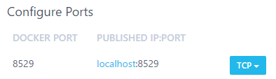
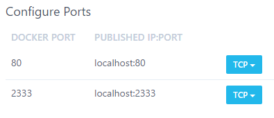

title: Decoupling WildBeast from Docker
description: Instructions on running WildBeast from source instead of from Docker
path: tree/master/docs
source: decoupling.md

This document outlines the procedure for decoupling WildBeast from Docker, allowing the entire system to be leveraged as opposed to a Docker sandbox.

## Preface

If you have already set up your WildBeast instance in accordance with the available installation guides, feel free to jump to the next section. If you have not done this yet, however, please follow through with that procedure before embarking onto this guide.

Additionally, consider whether you need to go through the decoupling process to begin with. The Docker container for WildBeast runs the code that is in the WildBeast install directory, and when the container is restarted, the changes are mirrored. However, if you want to use something akin to live reloading (Such as Nodemon) or have other valid reasons, feel free to proceed.

## Reconfiguring containers and WildBeast

Shutdown all existing Docker containers pertaining to WildBeast before starting.

!!! warning "Port conflicts"
    If you have other services running on ports **8529**, **80** or **2333**, select other available ports in the sections below and update your configuration accordingly. This is to avoid port conflicts. However, **do not modify the Docker port** in contradiction to this guide, or you will have trouble reaching the containers in the desired manner.

!!! bug "Exceptions for Docker Toolbox"
    If you're using Docker Toolbox, the hostname for a service will not be **localhost**. Due to how Docker Toolbox handles networking, the hostname will be an IPv4 address, such as **192.168.99.100**. In this case, this address must be used instead. The IP can be found by going to Kitematic and checking the **Hostname / Ports** section of any container.

First, open the **.env** configuration file in the directory to which you installed the WildBeast source code, and tweak these values as follows:

```bash
ARANGO_URI=http://localhost:8529
LAVA_NODES=[{"host":"localhost","port":80,"region":"us","password":"password"}]
LAVA_REST_PORT=2333
```

### Windows

Open Kitematic and browse to the settings of the **wildbeast_arango_1** container and go to the **Hostname / Ports** tab. Under **Configure Ports**, change the default value to look as follows.



Then hit Save. The container will now self-start. Proceed to the **Hostname / Ports** tab of the **wildbeast_lavalink_1** container and edit the same values as previously as follows.
  


And then hit Save as mentioned previously, which will self-start the container.

You may also remove the **wildbeast_install_1** and **wildbeast_wildbeast_1** containers at this stage. In future WildBeast will run from the source code as opposed to these images, which makes them redundant.

### Linux

!!! danger "Risk of data loss"
    Due to how Docker works on Linux, the containers created in the installation need to be removed and recreated before their networking can be altered. If you have substantial amounts of data in your database, consult relevant documentation on how to migrate your data, i.e. [this article](https://medium.com/@gchudnov/copying-data-between-docker-containers-26890935da3f).

For this section, you need to browse to the WildBeast source code directory.

Before you run the following commands, make sure that all WildBeast-related containers have been turned off. This can be checked by running `#!bash sudo docker ps`, and if the output contains no WildBeast-related containers, you're ready to go. Otherwise shut them down and then proceed.

```bash
sudo docker rm wildbeast_arango_1
sudo docker rm wildbeast_lavalink_1
# Check that the image versions are correct via 'sudo docker images'
# Also remember to ensure that the ports you're exposing (Format is DOCKER_PORT:EXPOSED_PORT) are available
sudo docker run -d --env-file arangodb.env --name wildbeast_arango_1 -p 8529:8529 arangodb:3.3.14
sudo docker run -d --env-file lavalink.env --name wildbeast_lavalink_1 -p 2333:2333 -p 80:80 fredboat/lavalink:v3
```

## Installing dependencies and starting

If you haven't already, browse to the WildBeast source code directory. Run `#!bash npm i` to install the dependencies required to run from source. If you have not yet initialised the database, do so by running `#!bash npm run dbcreate` after the dependency installation command finishes.

When the previous step has finished, run `npm start` in the terminal. If the output of that command resembles the following, you're finished.


!!! danger "Security considerations"
    With these steps, the ArangoDB and Lavalink instances are exposed to the local network. They are not exposed to the internet, which increases safety somewhat, but you should still take steps to secure at least your ArangoDB instance against unauthorised access. This can be accomplished by creating a non-root user in the ArangoDB web interface and enabling authentication for the database engine. Refer to instructions such as [this document](https://docs.arangodb.com/3.4/Manual/Security/) for further information.

Now you can start making modifications to the code and adding custom commands which will be useable to your end users.

Do bear in mind that the application process is not backgrounded unlike with Docker, so you may want to look into a process manager/orchestrator like [PM2](https://pm2.keymetrics.io) to keep the process running even if you close your terminal session.
