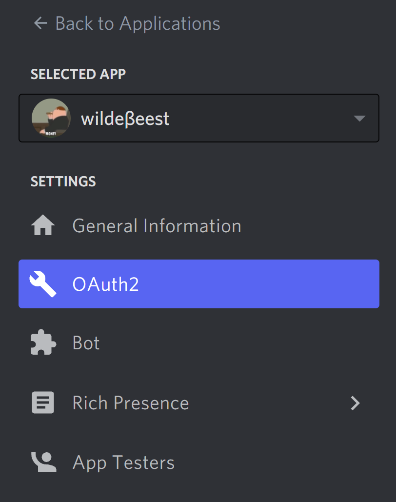
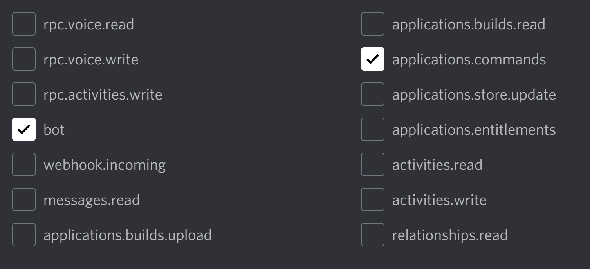
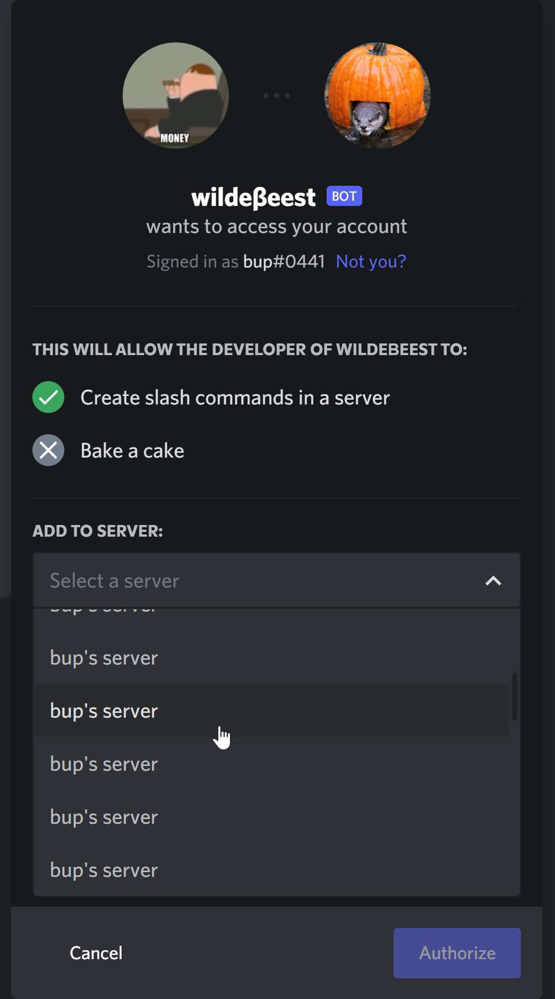

# Adding your bot to your server


Don’t have a bot account yet? Check out [this page](creating-a-bot-account.md) for instructions how to make one.


1. Once you have created a bot account, navigate to the OAuth2 page of your application
2.  Scroll down to the OAuth2 URL Generator and check the "applications.commands" and "bot" scopes

    
3.  Copy the link it generates and open it in a new tab, choosing what server you want to add it to, and hit "Authorize"

    


Don’t see the server you want to add the bot to? You need to have the ”Manage Server” permission in the server for it to show up.


