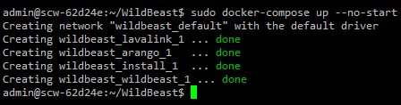

title: Linux installation guide
description: Linux installation guide for WildBeast
path: tree/master/docs
source: install_linux.md

This guide will detail how to install and setup WildBeast on Linux.

## Prerequisites

- Linux system
	  -  OS: Docker officially supports [these distributions](https://store.docker.com/search?type=edition&offering=community&operating_system=linux), but others may be used as well
    -  Root privileges (Sudo)
- [Git](https://git-scm.com/download/linux)
- [Node.js version 8 or above](https://nodejs.org/en/download/current/)
- A text editor. For command-line you may use Nano, Vim etc. while standalone editors like Visual Studio Code, Atom and Brackets are fine for systems with a desktop environment installed.

## Installation

You will need to install Docker and Docker Compose to use WildBeast. Find the guide for your distribution [here (Docker)](https://store.docker.com/search?type=edition&offering=community&operating_system=linux) and [here (Compose)](https://docs.docker.com/compose/install). For other distributions, you may use your own resources.

Complete the appropriate installation procedure and verify Docker is functional before proceeding.

### Setup

With that done, clone the WildBeast GitHub repository by running `#!bash git clone https://github.com/TheSharks/WildBeast.git`. After cloning, change to the `WildBeast` directory and open **.env.example** with your preferred text editor.

Edit the following parameters:

- **BOT_TOKEN**: Add your Discord bot token here. (Eg. [create a bot and add it to a server](https://github.com/reactiflux/discord-irc/wiki/Creating-a-discord-bot-&-getting-a-token))
- **BOT_PREFIX**: Add your preferred command prefix here. (Eg. **!**, **++**, etc.)
- **WILDBEAST_MASTERS**: Add a pipe-delimited list of user IDs you wish to set as super users here. (Eg. **152664793587777537|10790402390177792** and so on)

If you're running a custom ArangoDB instance and wish to use it, you can also edit **ARANGO_USERNAME**, **ARANGO_PASSWORD**, **ARANGO_DATABASE** and **ARANGO_URI** now. The same goes for the **LAVA_NODES** variable in case you're running a custom Lavalink instance.

When done, save the file as **.env**. Then run `#!bash sudo docker-compose up --no-start` in the WildBeast directory. When the container creation is done, run `#!bash sudo docker ps -a` and make sure that you have an output that resembles the following.

!!! warning
    It is paramount you save the file as **.env**. Do not leave it as **.env.example**, name it **.env.txt** or anything similar. Docker will not recognise it in this case.

!!! bug "Known docker-compose issues"
    On certain systems or setups Docker may refuse to run commands properly without **sudo** and will throw cryptic errors as a result. Try running the command with **sudo** before consulting help and also check your system process control to see if Docker is running.



### Initialising

To initialise WildBeast, run the following commands. Leave a second or two between each to account for startup times.

!!! note
    If you configured a custom ArangoDB instance previously, omit the first command.

```bash
sudo docker start wildbeast_arango_1
sudo docker start wildbeast_install_1
sudo docker logs wildbeast_install_1
```

If your output resembles the following, you're good to go.


After this, you will no longer need to run **wildbeast_install_1** unless you wish to repair the database - it's only around for database initialisation.

## Configuration

Now it's time to do some additional configuration. The minimum defaults have been defined already through docker-compose.yml, but the bot will only have fairly limited functionality if left at this state. Open **.env** again.

Here is a list of environment variables we recommend you define or at least consider defining. Check the footnotes for brief instructions on how to get the API keys below.

| Variable | Description | Commands using this | Type |
| -------- | ----------- | ------------------- | ---- |
| IMGFLIP_USERNAME | Imgflip username.[^1] | meme | String |
| IMGFLIP_PASSWORD | Imgflip password.[^1] | meme | String |
| IMGUR_KEY | Imgur API key.[^2] | randommeme | String |
| TWITCH_ID | Twitch client ID.[^3] | twitch | String |
| WILDBEAST_VOICE_PERSIST | Prevent the bot from automatically leaving a voice channel after a playlist has ended. | Music | Number (0/1)[^4] |
| WILDBEAST_DISABLE_MUSIC | Prevent all music functionality from being used. | Music | Number (0/1)[^4] |
| WILDBEAST_LANGUAGE | Set the language of the bot. Currently only English is available. | All | String |
| WILDBEAST_SUPPRESS_COMMANDLOG | Do not log command execution traces to the console. | All | Number (0/1)[^4] |

!!! tip
    There are more environment variables that can be defined as well. You can find the full reference in [.env.example](https://github.com/TheSharks/WildBeast/blob/master/.env.example).
    
    However, editing variables in the **Internal configuration** section is not recommended lest you know what you're doing. These variables exist for development and/or internal purposes and can have unintended side effects if tampered without a proper understanding of the software.

When you're done, save the file and close the editor.

## Running the bot

!!! note
    If you're running custom non-Docker instances for ArangoDB and Lavalink, and have configured WildBeast to use them, omit starting the first two containers.

Your WildBeast instance should now be good to go. Run the following commands in your terminal, waiting a second or two between each:

```bash
sudo docker start wildbeast_arango_1 # If you didn't start it or stopped it
sudo docker start wildbeast_lavalink_1
sudo docker start wildbeast_wildbeast_1
sudo docker logs wildbeast_wildbeast_1
```

If your output resembles the following, your bot is all set.


!!! bug "Connect ECONNREFUSED <IP\>:80"
    An error message saying **FATAL: Error: connect ECONNREFUSED <your IP\>:80** may happen when the **wildbeast_wildbeast_1** container is started too quickly and the Lavalink server is not ready. Wait a few seconds, then run `#!bash sudo docker restart wildbeast_wildbeast_1` and check the logs again.

!!! danger "Custom commands"
    If you wish to use the custom command aspect of WildBeast, or intend to make tweaks to the source code later down the line, follow the [Decoupling from Docker](decoupling.md) guide now. Due to how Docker works, data created in the ArangoDB container created here is non-transferable.

You can test the bot by running the **ping** command (With your prefix) in a text channel that the bot can see. If it answers "Pong!", then your bot is set up.

## Making changes

If you feel up for some tinkering, you're free to make modifications to the source code. When you have made your changes and want to deploy them, simply restart the **wildbeast_wildbeast_1** container with the command `#!bash sudo docker restart wildbeast_wildbeast_1`. The changes you made will then be reflected in the public facing bot.

**Note:** You make changes to the source code at your own risk and responsibility. Support will not be provided for issues that stem from modifying the source code improperly. In other words, issues that are not our responsibility cannot be remedied by us either.

## Closing words

If you have further questions or need help with something, we'd be happy to help. You can find a link to the official server below.

**Enjoy your bot and have fun!**

<p align="left">
  <a href="https://discord.gg/wildbot"></a>
</p>

[^1]: Go to https://imgflip.com, create an account and input your username and password here.

[^2]: Go to https://www.twitch.tv/settings/connections, register an application and input the client ID you get from that here.

[^3]: Go to https://api.imgur.com/oauth2/addclient, register an application and input the client ID (Not secret!) you get from that here.

[^4]: Set to 1 to enable this behaviour, or to 0 to disable it.
