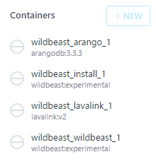
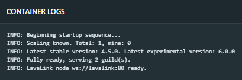

title: Windows installation guide
description: Windows installation guide for WildBeast
path: tree/master/docs
source: install_windows.md

This guide will detail how to install and setup WildBeast on Windows.

## Prerequisites

- Windows system
    - Minimum: Windows 10 Home 64-bit (Additional dependencies required)
    - Recommended: Windows 10 Professional or Enterprise 64-bit
    - Administrator access
- [Node.js version 8 or above](https://nodejs.org/en/download/current/)
- A text editor other than Windows Notepad. Notepad++, Visual Studio Code or any of the sort will suffice.

## Installation

!!! warning "Note about Windows 10 Home"
    Windows 10 Home lacks native virtualisation support, namely Hyper-V, which is used by Docker. Before you read on, find out your edition of Windows from either the Settings app (**Settings\System\About**) or the Control Panel (**Control Panel\System and Security\System**).

### Installing Docker

You will need to install Docker Community Edition and Kitematic to use WildBeast. Depending on your operating system, the procedure will slightly differ.

- If you are using W10 Professional or Enterprise, follow the instructions to install [Docker on Windows](https://docs.docker.com/docker-for-windows/install) and [Kitematic](https://github.com/docker/kitematic#installing-kitematic).
- If you are using W10 Home, follow the instructions to install [Docker Toolbox](https://docs.docker.com/toolbox/toolbox_install_windows).

Complete the appropriate installation procedure and verify Docker is functional before proceeding.

### Installing Git

It is highly recommended to use Git to retrieve WildBeast instead of downloading a ZIP package from GitHub for ease of updating later down the line.

Download [Git](https://git-scm.com) and install it with the following options:

- Features: Desktop icon, Explorer integration and TrueType console font can be omitted at will
- Text editor: Your personal preference
- Use Git from the Windows Command Prompt (**Important!**)
- Use OpenSSH and OpenSSL (**Important!**)
- Checkout as-is, commit Unix-style line endings
- Use MinTTY (If you're installing Git Bash)
- Additional options: Your personal preference

### Setup

With that done, clone the WildBeast GitHub repository by running `#!bash git clone https://github.com/TheSharks/WildBeast.git` in a terminal window. After cloning, change to the `WildBeast` directory and open **.env.example** with your preferred text editor.

Edit the following parameters:

- **BOT_TOKEN**: Add your Discord bot token here. (Eg. [create a bot and add it to a server](https://github.com/reactiflux/discord-irc/wiki/Creating-a-discord-bot-&-getting-a-token))
- **BOT_PREFIX**: Add your preferred command prefix here. (Eg. **!**, **++**, etc.)
- **WILDBEAST_MASTERS**: Add a pipe-delimited list of user IDs you wish to set as super users here. (Eg. **152664793587777537|10790402390177792** and so on)

If you're running a custom ArangoDB instance and wish to use it, you can also edit **ARANGO_USERNAME**, **ARANGO_PASSWORD**, **ARANGO_DATABASE** and **ARANGO_URI** now. The same goes for the **LAVA_NODES** variable in case you're running a custom Lavalink instance.

When done, save the file as **.env**. Then run `#!bash docker-compose up --no-start` in the WildBeast directory. When the container creation is done, open Kitematic and you should have the following containers present.

!!! warning
    It is paramount you save the file as **.env**. Do not leave it as **.env.example**, name it **.env.txt** or anything similar. Docker will not recognise it in this case.

!!! bug "Known docker-compose issues"
    Docker Toolbox does not start automatically with Windows out of the box - it needs to be started explicitly. Thus, if you do not perform this step, you may run into cryptic errors when attempting to compose. These errors are known to arise:

    **Could not connect to Docker daemon** 
    **Windows named pipe error: The system cannot find the file specified**

    Docker Toolbox should create a desktop icon called **Docker Quickstart Terminal** upon installation. Start it, wait for it to completely start (Until it shows **Start interactive shell**), restart your terminal and run the compose command again.

### Initialising

To initialise WildBeast, start the following containers in the following order. Wait for one to finish before proceeding.

!!! note
    If you configured a custom ArangoDB instance previously, omit the first step.

1. wildbeast_arango_1
2. wildbeast_install_1

You may have to hit Ctrl + R in order to refresh and see the container output.

The install container will self-exit when done. After this you do not need to run **wildbeast_install_1** again, as this only initialises the database. You can run it again if you wish to repair your database, however.

## Configuration

Open the settings for the **wildbeast_wildbeast_1** container and check the Environment Variables tab. The minimum defaults were defined previously, but the bot will only have fairly limited functionality if left at this state.

Here is a list of environment variables we recommend you define or at least consider defining. Check the footnotes for brief instructions on how to get the API keys below.

| Variable | Description | Commands using this | Type |
| -------- | ----------- | ------------------- | ---- |
| IMGFLIP_USERNAME | Imgflip username.[^1] | meme | String |
| IMGFLIP_PASSWORD | Imgflip password.[^1] | meme | String |
| IMGUR_KEY | Imgur API key.[^2] | randommeme | String |
| TWITCH_ID | Twitch client ID.[^3] | twitch | String |
| WILDBEAST_VOICE_PERSIST | Prevent the bot from automatically leaving a voice channel after a playlist has ended. | Music | Number (0/1)[^4] |
| WILDBEAST_DISABLE_MUSIC | Prevent all music functionality from being used. | Music | Number (0/1)[^4] |
| WILDBEAST_LANGUAGE | Set the language of the bot. Currently only English is available. | All | String |
| WILDBEAST_SUPPRESS_COMMANDLOG | Do not log command execution traces to the console. | All | Number (0/1)[^4] |

!!! tip
    There are more environment variables that can be defined as well. You can find the full reference in [.env.example](https://github.com/TheSharks/WildBeast/blob/master/.env.example).
    
    However, editing variables in the **Internal configuration** section is not recommended lest you know what you're doing. These variables exist for development and/or internal purposes and can have unintended side effects if tampered without a proper understanding of the software.

## Running the bot

!!! note
    If you're running custom non-Docker instances for ArangoDB and Lavalink, and have configured WildBeast to use them, omit starting the first two containers.

Your WildBeast instance should now be good to go. Start both the **wildbeast_arango_1** and **wildbeast_lavalink_1** containers, and when they're ready, start **wildbeast_wildbeast_1**. Wait for it to start, and if your output roughly resembles the following, you're set.

You can test the bot by running the **ping** command (With your prefix) in a text channel that the bot can see. If it answers "Pong!", then your bot is set up.

## Making changes

If you feel up for some tinkering, you're free to make modifications to the source code. When you have made your changes and want to deploy them, simply restart the **wildbeast_wildbeast_1** container in Kitematic. The changes you made will then be reflected in the public facing bot.

**Note:** You make changes to the source code at your own risk and responsibility. Support will not be provided for issues that stem from modifying the source code improperly. In other words, issues that are not our responsibility cannot be remedied by us either.

## Closing words

If you have further questions or need help with something, we'd be happy to help. You can find a link to the official server below.

**Enjoy your bot and have fun!**

  

[^1]: Go to https://imgflip.com, create an account and input your username and password here.

[^2]: Go to https://www.twitch.tv/settings/connections, register an application and input the client ID you get from that here.

[^3]: Go to https://api.imgur.com/oauth2/addclient, register an application and input the client ID (Not secret!) you get from that here.

[^4]: Set to 1 to enable this behaviour, or to 0 to disable it.
