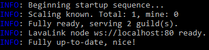

title: Minimal setup
description: Instructions on setting up WildBeast with internal dependencies only
path: tree/master/docs
source: minimal_setup.md

This document outlines the procedure for running WildBeast with as few external dependencies as possible. You may find this option useful if you want to get WildBeast working with the least amount of external dependency setup required, such as when using a particularly low-spec environment or if you don't want the extra hassle.

## Caveats

This way of running WildBeast is intended for a very specific niche, and the program makes compromises to fill that niche. If only possible, it's preferable to use the Docker-based setup procedure instead as the gains are notable. See other documentation in this category if that is what you seek.

!!! note
    **This procedure will not enable you to run WildBeast with zero external dependencies** - FFMPEG still has to be installed separately for audio encoding. You can, however, omit installing FFMPEG and set the **WILDBEAST_DISABLE_MUSIC** environment variable to **1**. This will limit the bot's functionality, but also requires no additional dependency setup.

Installing in this way has the following caveats:

1. Your users will lose out on audio quality. Due to FFMPEG being used in place of Lavalink, audio quality will decrease.
2. You will have reduced database stability and security. Due to a file-based database (Lokijs) being used instead of a full database server, you may encounter issues you would not have with server-based databases (Such as ArangoDB). You will also not be able to inspect database contents via a web interface.
3. You will lose the inherent process backgrounding Docker provides and will have to take care of this manually (With programs like [PM2](https://pm2.keymetrics.io)).

If this didn't shun you away, let's get started.

## Prerequisites

Before starting, make sure you have the following things already installed:

- [Node.js version 8 or above](https://nodejs.org/en/download/current/)
- Git ([Windows](install_windows.md#installing-git)/[Linux](https://git-scm.com/download/linux))
- FFMPEG ([Windows](https://windowsloop.com/install-ffmpeg-windows-10/)/[Linux](https://www.ostechnix.com/install-ffmpeg-linux/))

When all of the above prerequisites are installed and working, you may proceed to the next step.

## Installation

Clone the WildBeast repository by running `#!bash git clone https://github.com/TheSharks/WildBeast.git`. After cloning, change to the `WildBeast` directory and open **.env.example** with your preferred text editor.

Edit the following parameters:

- **BOT_TOKEN**: Add your Discord bot token here. (Eg. [create a bot and add it to a server](https://github.com/reactiflux/discord-irc/wiki/Creating-a-discord-bot-&-getting-a-token))
- **BOT_PREFIX**: Add your preferred command prefix here. (Eg. **!**, **++**, etc.)
- **WILDBEAST_MASTERS**: Add a pipe-delimited list of user IDs you wish to set as super users here. (Eg. **152664793587777537|10790402390177792** and so on)

Uncomment[^1] the following values and edit them as follows.

- **WILDBEAST_PREFERRED_DATABASE**: Set to "lokijs"
- **WILDBEAST_PREFERRED_ENCODER**: Set to "ffmpeg"

When done, save the file as **.env**.

!!! warning
    It is paramount you save the file as **.env**. Do not leave it as **.env.example**, name it **.env.txt** or anything similar. Docker will not recognise it in this case.

After this, run `npm i` to install the dependencies required for running WildBeast.

## Starting

When dependency installation has finished, run `npm start` in the WildBeast directory. If you get output that resembles the following, you're all set.

On Linux, you may want to consider using [PM2](https://pm2.keymetrics.io) to background the process in order for the process to stay running after the terminal session exits.

[^1]: Remove the "#" character from the start of the line.
